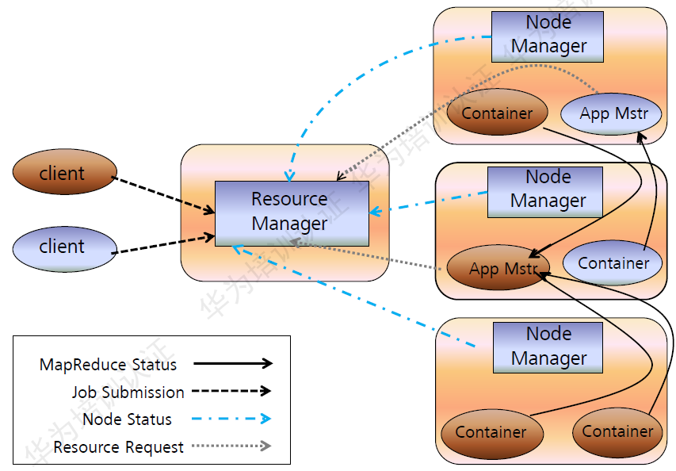
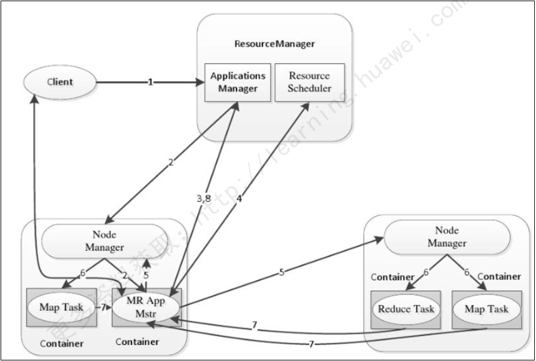

# Yarn
Apache Hadoop YARN（Yet Another Resource Negotiator,另一种资源协调者）是一种新的Hadoop资源管理器，它是一个通用资源管理系统，可为上层应用提供统一的资源管理和调度，它的引入为集群在利用率、资源统一管理和数据共享等方面带来的巨大的好处

## 基本概念 
> * ResourceManager：一个全局的资源管理器，负责整个系统的资源管理和分配，主要包括两个组件，即调度器（Scheduler）和应用程序管理器（Applications Manager）
>     * 调度器（Scheduler）：接收来自ApplicationMaster的应用程序资源请求，把集群中的资源以“容器”的形式分配给提出申请的应用程序，容器的选择通常会考虑应用程序所要处理的数据的位置，进行就近选择，从而实现“计算向数据靠拢”。其被设计成是一个可插拔的组件，YARN不仅自身提供了许多种直接可用的调度器，也允许用户根据自己的需求重新设计调度器
>         * 容器（Container）作为动态资源分配单位，每个容器中都封装了一定数量的CPU、内存、磁盘等资源，从而限定每个应用程序可以使用的资源量
>     * 应用程序管理器（Applications Manager）：负责系统中所有应用程序的管理工作，主要包括应用程序提交、与调度器协商资源以启动ApplicationMaster、监控ApplicationMaster运行状态并在失败时重新启动等
>
> * ApplicationMaster：ResourceManager接收用户提交的作业，按照作业的上下文信息以及从NodeManager收集来的容器状态信息，启动调度过程，为用户作业启动一个ApplicationMaster
>     1. 当用户作业提交时，ApplicationMaster与ResourceManager协商获取资源，ResourceManager会以容器的形式为ApplicationMaster分配资源
>     2. 把获得的资源进一步分配给内部的各个任务（Map任务或Reduce任务），实现资源的“二次分配”
>     3. 与NodeManager保持交互通信进行应用程序的启动、运行、监控和停止，监控申请到的资源的使用情况，对所有任务的执行进度和状态进行监控，并在任务发生失败时执行失败恢复（即重新申请资源重启任务）
>     4. 定时向ResourceManager发送“心跳”消息，报告资源的使用情况和应用的进度信息
>     5. 当作业完成时，ApplicationMaster向ResourceManager注销容器，执行周期完成。
>
> * NodeManager：驻留在YARN集群中的每个节点上的代理。主要负责管理抽象的容器，只处理与容器相关的事情，而不具体负责每个任务（Map任务或Reduce任务）自身状态的管理，因为这些管理工作是由ApplicationMaster完成的，ApplicationMaster会通过不断与NodeManager通信来掌握各个任务的执行状态 

## 工作流程
> 
> 1. 用户编写客户端应用程序，向YARN提交应用程序，提交的内容包括ApplicationMaster程序，启动ApplicationMaster的命令、用户程序等
> 2. YARN中的ResourceManager负责接收和处理来自客户端的请求，为应用程序分配一个容器，在该容器中启动一个ApplicationMaster
> 3. ApplicationMaster被创建后会首先向ResourceManager注册
> 4. ApplicationMaster采用轮询的方式向ResourceManager申请资源
> 5. ResourceManager以“容器”的形式向提出申请的ApplicationMaster分配资源
> 6. 在容器中启动任务（运行环境、脚本）
> 7. 各个任务向ApplicationMaster汇报自己的状态和进度
> 8. 应用程序运行完成后，ApplicationMaster向ResourceManager的应用程序管理器注销并关闭自己