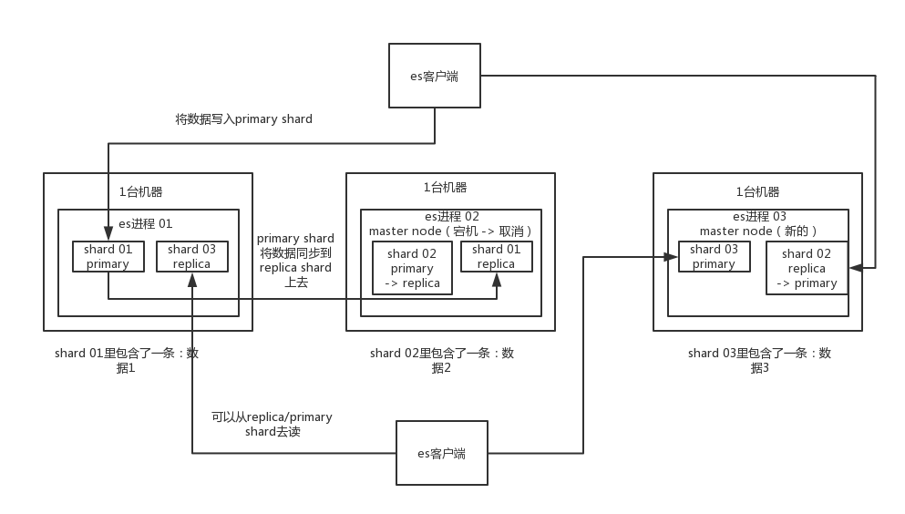

# ES
一个开源的高扩展的分布式全文检索引擎，它可以近乎实时的存储、检索数据；本身扩展性很好，可以扩展到上百台服务器，处理PB级别的数据

## 写入
流程：
1. 客户端选择一个node发送请求过去，这个node就是coordinating node (协调节点)
2. coordinating node，对document进行路由，将请求转发给对应的node
3. 实际上的node上的primary shard处理请求，然后将数据同步到replica node
4. coordinating node，如果发现primary node和所有的replica node都搞定之后，就会返回请求到客户端

原理：
1. 数据先写入到buffer里面，在buffer里面的数据时搜索不到的，同时将数据写入到translog日志文件之中 
2. 如果buffer快满了，或是一段时间之后，就会将buffer数据refresh到一个新的OS cache之中，然后每隔1秒，就会将OS cache的数据写入到segment file之中，但是如果每一秒钟没有新的数据到buffer之中，就会创建一个新的空的segment file，只要buffer中的数据被refresh到OS cache之中，就代表这个数据可以被搜索到了。当然可以通过restful api 和Java api，手动的执行一次refresh操作，就是手动的将buffer中的数据刷入到OS cache之中，让数据立马搜索到，只要数据被输入到OS cache之中，buffer的内容就会被清空了。同时进行的是，数据到shard之后，就会将数据写入到translog之中，每隔5秒将translog之中的数据持久化到磁盘之中 
3. 重复以上的操作，每次一条数据写入buffer，同时会写入一条日志到translog日志文件之中去，这个translog文件会不断的变大，当达到一定的程度之后，就会触发commit操作。
4. 将一个commit point写入到磁盘文件，里面标识着这个commit point 对应的所有segment file
5. 强行将OS cache 之中的数据都fsync到磁盘文件中去。(translog的作用：在执行commit之前，所有的而数据都是停留在buffer或OS cache之中，无论buffer或OS cache都是内存，一旦这台机器死了，内存的数据就会丢失，所以需要将数据对应的操作写入一个专门的日志问价之中，一旦机器出现宕机，再次重启的时候，es会主动的读取translog之中的日志文件的数据，恢复到内存buffer和OS cache之中)
6. 将现有的translog文件进行清空，然后在重新启动一个translog，此时commit就算是成功了，默认的是每隔30分钟进行一次commit，但是如果translog的文件过大，也会触发commit，整个commit过程就叫做一个flush操作，我们也可以通过ES API,手动执行flush操作，手动将OS cache 的数据fsync到磁盘上面去，记录一个commit point，清空translog文件
(其实translog的数据也是先写入到OS cache之中的，默认每隔5秒之中将数据刷新到硬盘中去，也就是说，可能有5秒的数据仅仅停留在buffer或者translog文件的OS cache中，如果此时机器挂了，会丢失5秒的数据，但是这样的性能比较好，我们也可以将每次的操作都必须是直接fsync到磁盘，但是性能会比较差。)
7. 如果时删除操作，commit的时候会产生一个.del文件，里面讲某个doc标记为delete状态，那么搜索的时候，会根据.del文件的状态，就知道那个文件被删除了。 
8. 如果时更新操作，就是讲原来的doc标识为delete状态，然后重新写入一条数据即可。
9. buffer每次更新一次，就会产生一个segment file 文件，所以在默认情况之下，就会产生很多的segment file 文件，将会定期执行merge操作
10. 每次merge的时候，就会将多个segment file 文件进行合并为一个，同时将标记为delete的文件进行删除，然后将新的segment file 文件写入到磁盘，这里会写一个commit point，标识所有的新的segment file，然后打开新的segment file供搜索使用。

## 读取
流程：  
查询，GET某一条的数据，写入某个document，这个document会自动给你分配一个全局的唯一ID，同时跟住这个ID进行hash路由到对应的primary shard上面去，当然也可以手动的设置ID
1. 客户端发送任何一个请求到任意一个node，成为coordinate node
2. coordinate node 对document进行路由，将请求转发到对应的node，此时会使用round-robin随机轮训算法，在primary shard 以及所有的replica中随机选择一个，让读请求负载均衡，
3. 接受请求的node，返回document给coordinate note
4. coordinate node返回给客户端

## 搜索
流程：
1. 客户端发送一个请求给coordinate node
2. 协调节点将搜索的请求转发给所有的shard对应的primary shard 或replica shard
3. query phase：每一个shard 将自己搜索的结果（其实也就是一些唯一标识），返回给协调节点，有协调节点进行数据的合并，排序，分页等操作，产出最后的结果
4. fetch phase ，接着由协调节点，根据唯一标识去各个节点进行拉去数据，最总返回给客户端

原理：
1. 查询阶段 
   1. 当一个节点接收到一个搜索请求，这这个节点就会变成协调节点，第一步就是将广播请求到搜索的每一个节点的分片拷贝，查询请求可以被某一个主分片或某一个副分片处理，协调节点将在之后的请求中轮训所有的分片拷贝来分摊负载。
   2. 每一个分片将会在本地构建一个优先级队列，如果客户端要求返回结果排序中从from 名开始的数量为size的结果集，每一个节点都会产生一个from+size大小的结果集，因此优先级队列的大小也就是from+size，分片仅仅是返回一个轻量级的结果给协调节点，包括结果级中的每一个文档的ID和进行排序所需要的信息。
   3. 协调节点将会将所有的结果进行汇总，并进行全局排序，最总得到排序结果。
2. 取值阶段
   1. 查询过程得到的排序结果，标记处哪些文档是符合要求的，此时仍然需要获取这些文档返回给客户端
   2. 协调节点会确定实际需要的返回的文档，并向含有该文档的分片发送get请求，分片获取的文档返回给协调节点，协调节点将结果返回给客户端。