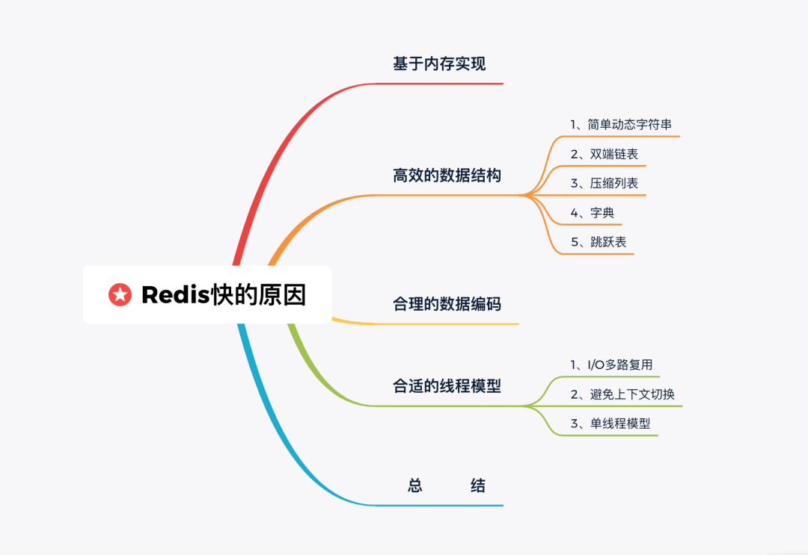
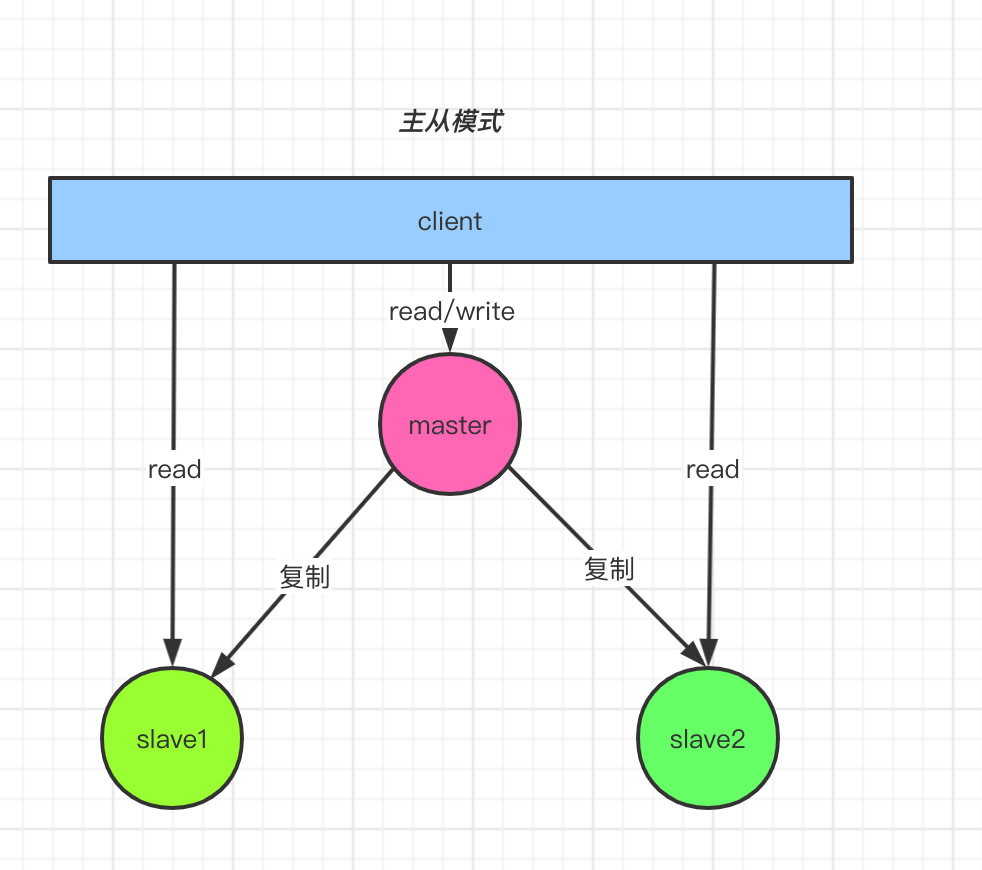
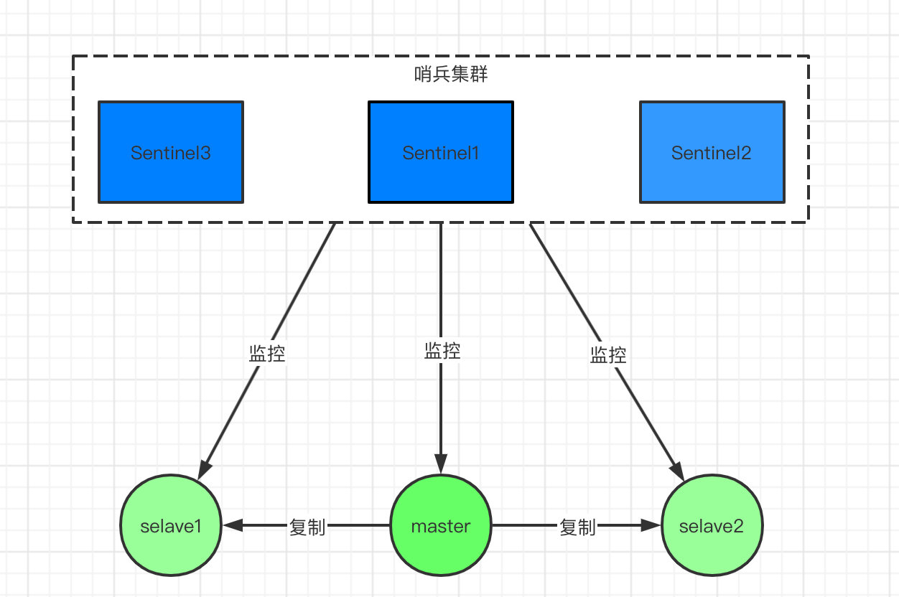
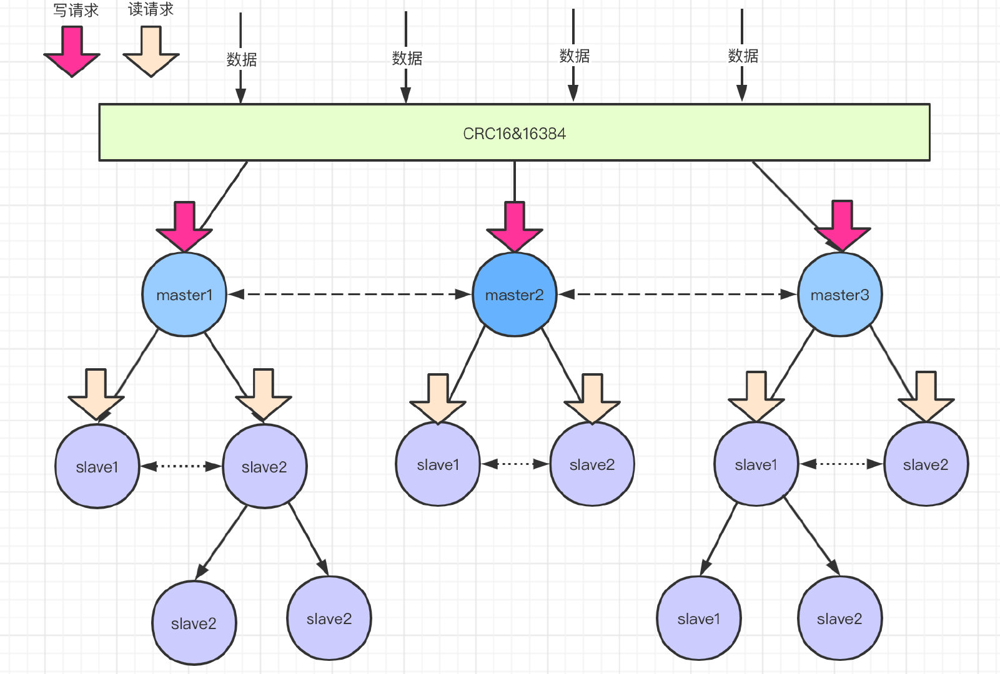

#Redis

## 数据类型
string, hash, list, set, zset

## 持久化
|&nbsp;|RDB|AOF|
|-------|:---|:---|
|启动优先级|低|高|
|体积|小|大|
|恢复速度|快|慢|
|数据安全性|丢数据|根据策略决定|
|轻重|重|轻|

## 工作流程

因此，Redis单线程是指执行命令的核心模块是单线程。

## 内存淘汰
> * noeviction（默认策略）：对于写请求不再提供服务，直接返回错误（del请求和部分特殊请求除外）
> * allkeys-lru：从所有key中使用LRU算法进行淘汰
> * volatile-lru：从设置了过期时间的key中使用LRU算法进行淘汰
> * allkeys-random：从所有key中随机淘汰数据
> * volatile-random：从设置了过期时间的key中随机淘汰
> * volatile-ttl：在设置了过期时间的key中，根据key的过期时间进行淘汰，越早过期的越优先被淘汰
>
> **以下算法在Redis 4.0后提供**
> * volatile-lfu：在设置了过期时间的key中使用LFU算法淘汰key
> * allkeys-lfu：在所有的key中使用LFU算法淘汰数据

LRU（Least Recently Used）：最近最少使用，如果一个数据在最近一段时间没有被用到，那么将来被使用到的可能性也很小，所以就可以被淘汰掉
LFU（Least Frequently Used）：根据key的最近被访问的频率进行淘汰，很少被访问的优先被淘汰，被访问的多的则被留下来

## Redis为什么快

可查看详细解释：https://www.jianshu.com/p/6cb9e96207f8

## 部署模式
### 单机
> 优点：
> * 部署简单，0成本
> * 成本低，没有备用节点，不需要其他的开支
> * 高性能，单机不需要同步数据，数据天然一致性
> 
> 缺点：
> * 可靠性保证不是很好，单节点有宕机的风险
> * 单机高性能受限于CPU的处理能力，redis是单线程的

### 主从复制
指将一台Redis服务器的数据，复制到其他的Redis服务器。前者称为主节点(master)，后者称为从节点(slave)；数据的复制是单向的，只能由主节点到从节点

> 优点：
> * 当主节点宕机，从节点作为主节点的备份可以随时顶上来
> * 扩展主节点的读能力，分担主节点读压力
> * 高可用基石：除了上述作用以外，主从复制还是哨兵模式和集群模式能够实施的基础，因此说主从复制是Redis高可用的基石
>
> 缺点：
> * 一旦主节点宕机，从节点晋升成主节点，同时需要修改应用方的主节点地址，还需要命令所有从节点去复制新的主节点，整个过程需要人工干预
> * 主节点的写能力受到单机的限制
> * 主节点的存储能力受到单机的限制

### 哨兵

> 优点：
> * 哨兵模式是基于主从模式的，所有主从的优点，哨兵模式都具有
> * 主从可以自动切换，系统更健壮，可用性更高。
> * Sentinel会不断的检查主服务器和从服务器是否正常运行。当被监控的某个Redis服务器出现问题，Sentinel通过API脚本向管理员或者其他的应用程序发送通知
>
> 缺点：
> * Redis较难支持在线扩容，对于集群，容量达到上限时在线扩容会变得很复杂

### 集群
