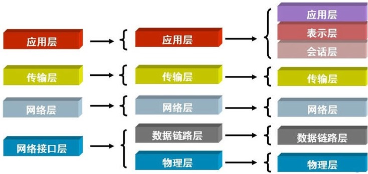

# OSI七层协议
互联网协议按照功能不同分为osi七层或tcp/ip五层或tcp/ip四层

每层常见物理设备

OSI七层协议输出传输的封包与解包

## TCP/IP
> TCP/IP模型是互联网的基础，它是一系列网络协议的总称(TCP，UDP，IP，FTP，HTTP，ICMP，SMTP等)。这些协议可以划分为四层，分别为链路层、网络层、传输层和应用层。

### UDP
UDP协议全称是用户数据报协议，在网络中它与TCP协议一样用于处理数据包，是一种无连接的协议

### TCP
TCP协议全称是传输控制协议，是一种面向连接的、可靠的、基于字节流的传输层通信协议

### TCP VS UDP
|&nbsp;|UDP|TCP|
|-------|:---|:---|
|是否连接|无连接|面向连接|
|是否可靠|不可靠传输，不使用流量控制和拥塞控制|可靠传输，使用流量控制和拥塞控制|
|连接对象个数|支持一对一，一对多，多对一和多对多交互通信|智能一对一通信|
|传输方式|面向报文|面向字节流|
|首部开销|开销小，仅8字节|最小20字节，最大60字节|
|适用场景|适用于实时应用（IP电话、视屏会议、直播等）|适用于要求可靠传输的应用（文件传输）|

### HTTP
> HTTP协议即超文本传送协议(Hypertext Transfer Protocol )，是Web联网的基础，也是手机联网常用的协议之一，HTTP协议是建立在TCP协议之上的一种应用。
HTTP连接最显著的特点是客户端发送的每次请求都需要服务器回送响应，在请求结束后，会主动释放连接。从建立连接到关闭连接的过程称为“一次连接”。
#### 完整HTTP请求
1. 域名解析
2. 发起TCP的3次握手建立连接
3. 发起http请求
4. 服务器响应http请求
5. 浏览器解析html代码，并请求html代码中的资源
6. 4次挥手断开TCP连接
7. 浏览器对页面进行渲染呈现给用户